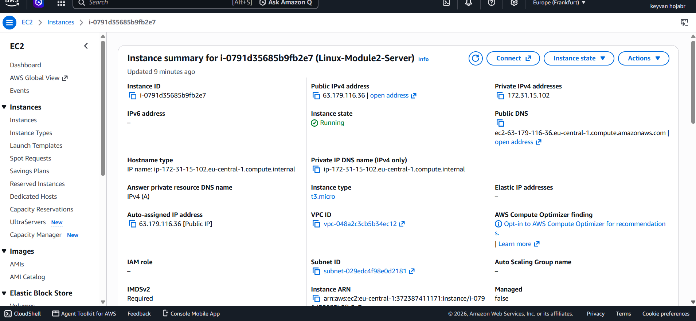
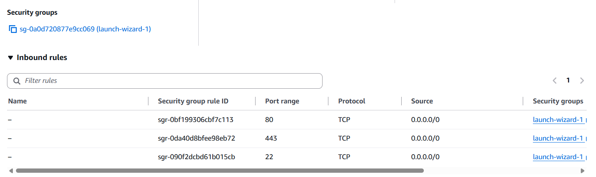
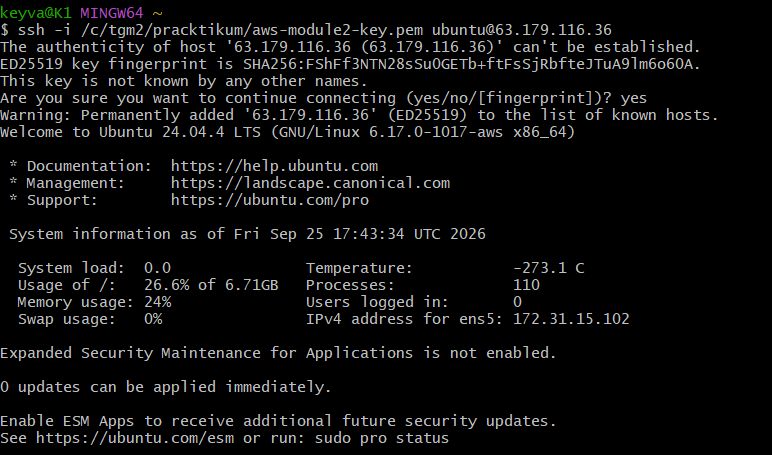
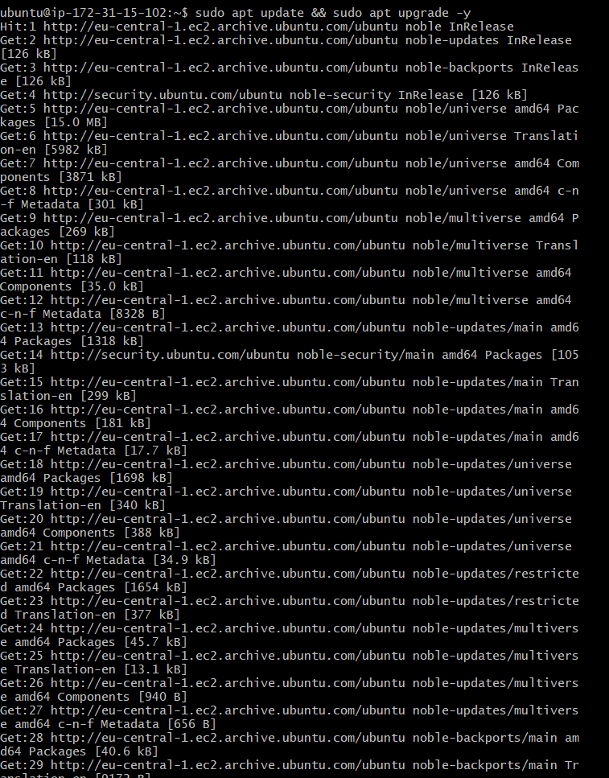
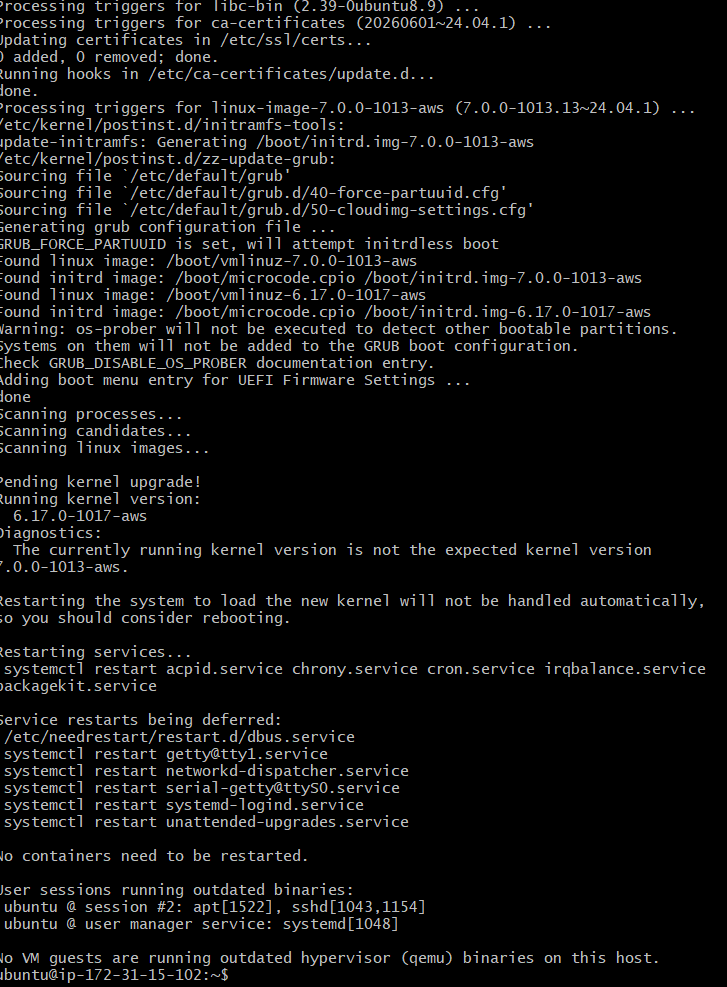
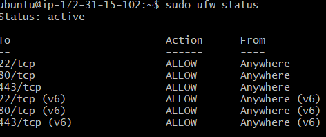
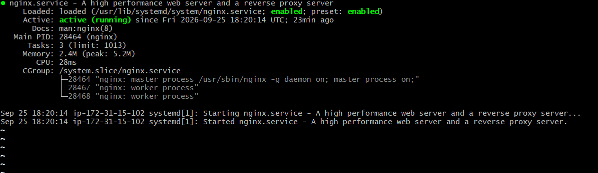
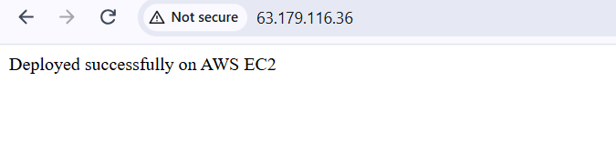

# Module 2: Linux, Networking & Cloud Infrastructure (AWS)

## Architecture & Steps
- **Cloud Provider:** AWS EC2 (Ubuntu 24.04 LTS)
- **Networking & Security:** Configured AWS Security Groups (Ports 22, 80, 443) and Linux UFW.
- **Linux Administration:** User management (`devuser`), permission handling, and process monitoring.
- **Web Deployment:** Configured Nginx web server to serve a custom web application.

## Screenshots

